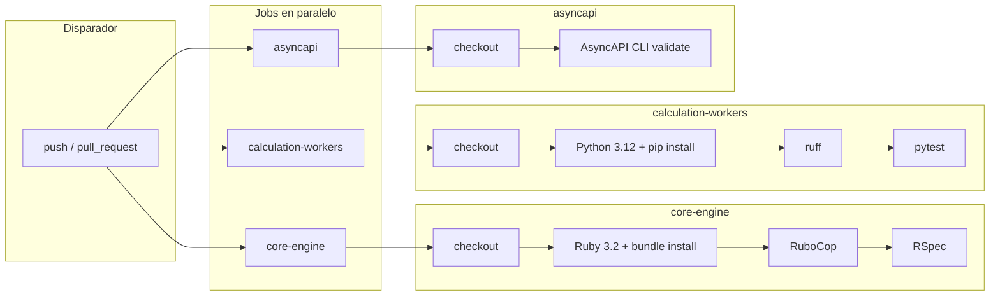

# CI/CD - Fisco.io

**Circuito de CI/CD** del Framework de Administración Tributaria. Este documento describe el pipeline de integración continua (CI) y su equivalencia local.

## Resumen

El pipeline **valida y ejecuta tests** en cada push y en cada pull request a las ramas `main` y `master`. No hay despliegue automático (CD) en el estado actual; el workflow se centra en lint, tests y validación del spec AsyncAPI.

**Definición del workflow:** [.github/workflows/ci.yml](../.github/workflows/ci.yml)

## Disparadores (triggers)

| Evento        | Ramas      |
|---------------|------------|
| `push`        | `main`, `master` |
| `pull_request`| `main`, `master` |

Cada evento ejecuta los tres jobs en **paralelo**.

## Diagrama del flujo

## Detalle por job

| Job                 | Entorno        | Servicios        | Pasos principales                                      | Variables de entorno |
|---------------------|----------------|------------------|--------------------------------------------------------|----------------------|
| **core-engine**     | ubuntu-latest  | postgres:16, redis:7 | checkout → Ruby 3.2 → bundle install (cache) → RuboCop → RSpec | DATABASE_URL, REDIS_URL, RAILS_ENV=test |
| **calculation-workers** | ubuntu-latest  | —                | checkout → Python 3.12 → pip install (cache) → ruff → pytest | — |
| **asyncapi**        | ubuntu-latest  | —                | checkout → npx @asyncapi/cli validate docs/asyncapi/events.yaml | — |

### core-engine

- **Imagen de servicios:** Postgres 16, Redis 7 (con health checks).
- **Ruby:** 3.2, con `bundler-cache: true` en `services/core-engine`.
- **Lint:** `bundle exec rubocop --format simple` (no falla el job si hay ofensas).
- **Tests:** `bundle exec rspec --format documentation`.

### calculation-workers

- **Python:** 3.12, cache de pip usando `services/calculation-workers/requirements.txt`.
- **Lint:** `ruff check src/` (ruff se instala en el paso de lint).
- **Tests:** `pytest -v`.

### asyncapi

- **Validación:** `npx -y @asyncapi/cli@latest validate docs/asyncapi/events.yaml`. El job no falla si la validación falla (`|| true`); se puede endurecer quitando el `|| true` cuando el spec sea estable.

## Cómo reproducir localmente

Equivalente al CI sin GitHub Actions:

1. **Makefile (recomendado):**
   - `make ci` — ejecuta lint + test + validate-asyncapi (réplica del CI).
   - Por servicio: `make lint-core`, `make test-core`, `make lint-workers`, `make test-workers`, `make validate-asyncapi`.
2. **Runme:** Ver [docs/runme/README.md](runme/README.md) para celdas ejecutables (entorno, infra, tests, lint, validación AsyncAPI).

Requisitos locales: Ruby 3.2, Python 3.12, Node (para npx), y para tests de core-engine: Postgres y Redis (por ejemplo `make infra-only` y variables DATABASE_URL / REDIS_URL en `.env`).

## CD / Despliegue

En el estado actual **no hay pipeline de despliegue** (CD). El workflow solo hace CI.

**Próximos pasos (futuro):** Cuando se implemente despliegue a staging o producción (Railway, Render, Kubernetes, etc.), se añadirá:
- Workflow(s) de deploy o pasos de release.
- Documentación en este mismo documento o en un `docs/deploy.md` con el circuito de CD y los entornos.

## Enlaces

- [.github/workflows/ci.yml](../.github/workflows/ci.yml) — Definición del workflow.
- [docs/runme/README.md](runme/README.md) — Scripts de desarrollo ejecutables con Runme.
- [README.md](../README.md) — Visión general del proyecto y cómo ejecutar.

---

Fisco.io — Framework de Administración Tributaria
